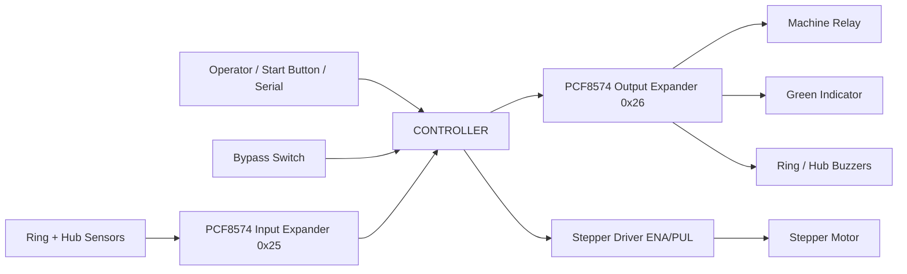
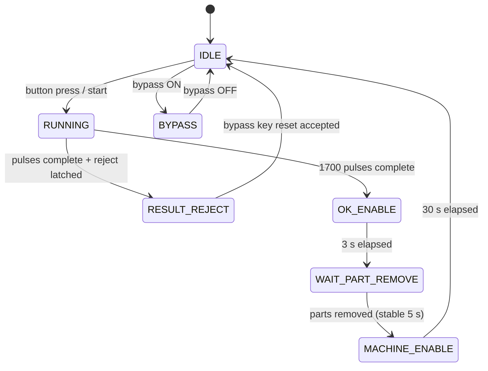

# Colour Sensor Adhesive Inspection System

## Problem Statement

Painted parts need to be inspected automatically and removed from the production process before the machine can move on to the next step. The controller must detect part presence, rotate the part for inspection, reject faults immediately, and keep the operator informed with indicators, buzzers, and serial diagnostics.

## Solution Overview
This System uses an Microcontroller to control a stepper motor, read two sensors, and manage outputs.
- waits in `IDLE` until the cycle-start button is pressed or `start` is sent over serial
- rotates the part with a stepper motor for exactly `1700` pulses
- checks the ring and hub sensors during the run, latches any reject seen, and decides the final result at the end of the full rotation
- shows an OK indication on the green indicator for `3 s`, waits for removal, then enables the machine relay for a timed window
- supports bypass mode, reject statistics, and serial diagnostics
- persists final cycle result (`OK`/`REJECT`) and reject part cause in EEPROM across reboot

## System Architecture





## Hardware/Software Details

### Hardware

| Component        | Detail                 |
|------------------|------------------------|
|IIOT Gateway      | ESP32 Based Controller |
|Stepper Motor     |                        |
|Motor Driver      | Stepper driver         |
|Colour Sensors    | ELCO OSM47             |
|Push Button       | Cycle start button     |
|Indicator         | Green LED              |
|Buzzer            | Red buzzer             |
|Key Switch        | Bypass switch          |
|Power Switch      | Main power switch      |
|Relay Card        | Machine enable relay   |
|Enclosure Box     | MS enclosure Panel Box |

### input map 

| Input | Symbol         | Signal | Logic |
|-------|----------------|--------|-------|
| 7     | `S1_IN`        | Ring sensor | `0` = part present / OK, `1` = removed / fault |
| 6     | `S2_IN`        | Hub sensor | `0` = part present / OK, `1` = removed / fault |
| 5     | `CYCLE_START`  | Cycle start button | `0` = pressed, `1` = released |
| 4     | `BYPASS_MODE`  | Bypass switch | `0` = bypass ON, `1` = normal mode |

###  output map 

| Output | Symbol  | Signal           | Detail                                                    |
|--------|---------|------------------|-----------------------------------------------------------|
| 0      | `OUT_0` | Relay            | Machine enable relay                                      |
| 1      | `OUT_1` | Spare            | Not used                                                  |
| 2      | `OUT_2` | Green indicator  | ON during OK-indication, machine-enable, and bypass states|
| 3      | `OUT_3` | Ring buzzer      | Reject alarm for ring-side fault                          |
| 4      | `OUT_4` | Hub buzzer       | Reject alarm for hub-side fault                           |

### Motor driver 

| Pin |Detail            |
|-----|------------------|
|ENA  |Stepper enable   |
|PUL  | Stepper pulse    | 
|DIR  |Stepper direction | 

### Software stack

| Layer | Technology |
|---|---|
| Firmware language | Arduino C++ |
| Core I/O library | `Wire.h` |
| Runtime | Arduino ESP32 core `3.3.6` |
| Target architecture | ESP32 (`esp32:esp32:esp32`) |
| Control style | Non-blocking state machine |
| Timing APIs | `millis()` / `micros()` |

## Key Features

- Automatic start from button press or serial command
- Full-cycle reject collection with final decision after all `1700` pulses
- Separate reject causes for ring, hub, or both sensors
- OK indication on green indicator for `3 s`, then removal wait and machine-enable relay timing
- Bypass mode that forces relay ON until switched off
- Reject statistics with `yes` confirmation required before reset
- EEPROM-backed reject latch restore at boot (reset/power-cycle cannot bypass reject)
- Serial diagnostics for status, stats, and control (`help`, `status`, `stats`, `reset_stats`, `start`, `stop`, `boot`, `eeprom`)
- I2C fallback to cached input on read failure
- Synchronized dual-buzzer output for `REJECT_BOTH` using a single expander write

## Results

### Verified behavior from the firmware

| Metric                  | Value         | Notes                                                               |
|-------------------------|---------------|---------------------------------------------------------------------|
| Motor cycle length      | `1700` pulses | One full inspection run                                             |
| Step pulse half-period  | `781 µs`      | Derived from firmware constant                                      |
| Approx. step frequency  | `~640 Hz`     | $f \approx \frac{1}{2 \cdot 781\,\mu s}$                            |
| Sensor polling interval | `20 ms`       | PCF8574 input poll rate                                             |
| Sensor check cadence    | `10` pulses   | During active motion                                                |
| OK indicator window     | `3 s`         | before entering removal wait                                        |
| Removal settle delay    | `5 s`         | both sensors must stay HIGH this long before the machine is enabled |
| Machine-enable window   | `30 s`        | relay ON after stable removal                                       |
| Confirmation timeout    | `10 s`        | For reset confirmation                                               |

### Accuracy / latency / reliability

- **Accuracy:** removal is only accepted once both sensors read HIGH continuously for the full `5 s` settle delay, which filters out bounce or momentary false triggers. Note: the current firmware does **not** check sensor state before starting a cycle — a cycle will start on button press or the `start` command regardless of whether parts are present.
- **Latency:** sensor faults are latched during the run on the next sensor-check interval, while the final reject/OK decision is made after the full `1700`-pulse cycle completes.
- **Reliability:** I2C read failures fall back to the last cached input byte instead of crashing the sketch, and the logic avoids blocking delays. During `MACHINE_ENABLE`, if a part is put back (either sensor goes LOW), outputs are cleared immediately and the system returns to `IDLE`.
- **Reliability:** reject outcome and reject cause are persisted in EEPROM. If the last cycle ended in reject, the controller restores `RESULT_REJECT` at startup and requires bypass-key reset.

> Note: these results are derived from the code and timing constants, not from a calibrated production test bench.

## Demo

No image, video, or GIF is currently included in the repository.

Suggested demo assets to add later:

- `docs/demo-cycle.gif` — a full start-to-finish cycle
- `docs/status-screen.png` — serial monitor status output
- `docs/wiring-diagram.png` — hardware wiring reference

### Serial commands

Commands are lowercase, including the reset confirmation (`yes`).

| Command       | Description                                                              |
|---------------|--------------------------------------------------------------------------|
| `help`        | Print the list of available commands                                     |
| `status`      | Print current state, sensor readings, pulse count, and last reject cause |
| `stats`       | Print reject statistics only                                             |
| `reset_stats` | Ask for confirmation before clearing reject statistics                   |
| `yes`         | Confirm a pending `reset_stats` action within 10 seconds                 |
| `start`       | Start a cycle from serial only when the system is `IDLE`                 |
| `stop`        | Stop the motor, clear outputs, and return to `IDLE` (blocked in `REJECT`) |
| `boot`        | Restart the ESP32 (`ESP.restart()`)                                      |
| `eeprom`      | Print persisted EEPROM latch state (`OK`/`REJECT`) and reject cause      |

### Example `status` output

```text  
===== STATUS =====
State       : RUNNING
S1 Ring (p7): 0
S2 Hub  (p6): 0
BTN     (p5): 1
BYPASS  (p4): 1
Pulses      : 400 / 1700
Last Reject : None
==================
===== REJECT STATS =====
Total Rejects : 0
Ring  Rejects : 0
Hub   Rejects : 0
Both  Rejects : 0
========================
```

## Folder Structure

```text
Adhesive_inspection/
├── main.ino                 # Main firmware sketch
├── config.h                 # Pin map, timing constants, and reject codes
├── types.h                  # System state and stats types
├── globals.h                # Runtime globals
├── pcf_io.h                 # PCF8574 input/output helpers
├── motor.h                  # Stepper enable/disable helpers
├── cycle.h                  # State handlers and cycle logic
├── serial_console.h         # Serial command handling and diagnostics
├── persist_eeprom.h         # EEPROM persistence for final result/reject latch
├── readme.md                # Project documentation
└── build/                   # Generated Arduino build output
    ├── sketch/
    ├── core/
    └── ...
```

## Future Improvements

- Add a part-presence check (`S1_IN`/`S2_IN` both LOW) before allowing a cycle to start
- Add a wiring diagram and real machine photos to the demo section
- Extend EEPROM persistence to include reject stats / cycle history
- Add debouncing / stronger input filtering for noisy sensors
- Expose configuration values through serial commands or a simple UI
- Add a calibration mode for timing and sensor thresholds
- Replace text-only status with a small dashboard or web UI

## Serial Log Reference

| Tag | Meaning |
|---|---|
| `[BTN]` | Cycle-start button event detected |
| `[OK]` | A condition passed |
| `[WARN]` | A warning or rejected start condition |
| `[MOTOR]` | Motor pulse progress or motor state |
| `[REJECT]` | A bad colour or fault was detected |
| `[OUT]` | Output state changed |
| `[TIMER]` | Machine-enable timer expired |
| `[INFO]` | General state transition or operator guidance |
| `[LOCK]` | Command/action blocked until supervisor reset condition is met |
| `[STOP]` | System reset via serial command |
| `[BYPASS]` | Bypass mode entered or exited |
| `[CONFIRM]` | Confirmation required for a destructive command |
| `[TIMEOUT]` | Confirmation window expired |
| `[CANCELLED]` | A pending confirmation was cancelled by a non-`yes` reply |
| `[BOOT]` | Startup condition detected (e.g. bypass active at power-on) |
| `[EEPROM]` | EEPROM persistence state/health output |